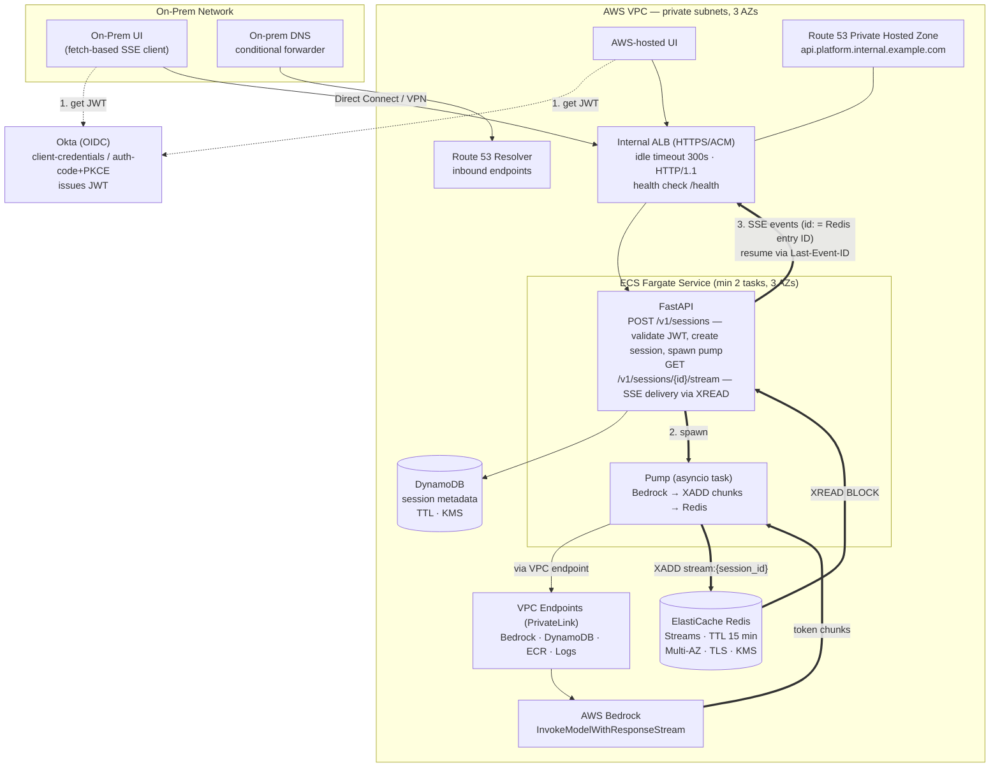

# Bedrock Streaming Platform — Solution Architecture & Implementation Guide

**Status:** Approved design (v1.0)
**Pattern:** Resumable SSE streaming with decoupled producer/delivery
**Stack:** FastAPI on ECS Fargate · Internal ALB · ElastiCache Redis Streams · DynamoDB · AWS Bedrock · Okta (OIDC)
**Callers:** One UI hosted in AWS (in-VPC), one UI hosted on-prem (via Direct Connect / VPN)
**Data classification:** Protected/regulated data — private networking end-to-end, encryption at every hop

---

## 1. Executive Summary

The platform exposes a streaming API that fronts AWS Bedrock. Generations take 1–2 minutes, which rules out REST API Gateway (29-second hard timeout) and makes connection resilience the central design problem.

The core architectural decision is to **decouple producing the stream from delivering it**:

- A **pump** consumes the Bedrock response stream once per session and buffers every chunk into a Redis Stream.
- A **delivery endpoint** serves those chunks to the client over SSE, replaying from any offset.

Consequences of this decoupling:

1. **Client disconnects are free.** The client reconnects with `Last-Event-ID` and resumes exactly where it left off. Network blips on the on-prem path cost nothing.
2. **Deploys cause zero user-visible downtime.** Blue/green task replacement only drops connections, never generations. Clients transparently reconnect to healthy tasks.
3. **Bedrock is invoked exactly once per session** regardless of client retries — no duplicate token spend, no duplicate generations.
4. **Any task can serve any session's stream** — horizontal scaling is trivial.

Authentication is OIDC via **Okta**: both UIs obtain a JWT and send it as a Bearer token; FastAPI validates it before any data flows. All traffic stays on private network paths (internal ALB; Direct Connect/VPN for on-prem; PrivateLink for AWS service calls).

**Deliberately rejected alternatives:**

| Alternative | Why rejected |
|---|---|
| REST API Gateway | 29s integration timeout kills 1–2 min streams |
| Lambda as SSE server | Response streaming only works via public Function URLs; incompatible with private networking + OIDC; pay-per-ms to hold idle connections |
| AppSync Events / API GW WebSocket | Public endpoints only — disqualified by the regulated-data / private-path requirement |
| Step Functions for streaming | Structurally cannot relay a token stream; orchestration-only tool |
| ALB OIDC auth action | Built for interactive browser login, not service-to-service; auth belongs in-app here |

Lambda remains a legitimate **v2 option for the pump only** (event-driven Bedrock→Redis job, 15-min cap is ample). Step Functions enters only if the workflow becomes multi-stage/agentic — orchestrating stages that each write progress events into the same Redis stream.

---

## 2. Architecture Diagram



---

## 3. Request Lifecycle

1. UI authenticates against Okta and obtains a JWT (access token).
2. UI calls `POST /v1/sessions` with the prompt payload and `Authorization: Bearer <JWT>`.
3. FastAPI validates the token (signature via Okta JWKS, `iss`, `aud`, `exp`, scope), writes a session record to DynamoDB, spawns the pump as an asyncio task, and returns `201 { session_id, stream_url }` in under ~100 ms.
4. The pump calls `InvokeModelWithResponseStream` and `XADD`s every chunk to `stream:{session_id}` in Redis (15-minute TTL), finishing with a terminal `done` or `error` entry.
5. UI opens `GET /v1/sessions/{id}/stream`. FastAPI validates the JWT again, **asserts the token's `sub` matches the session's `owner_sub`**, then enters a blocking `XREAD` loop, yielding SSE events whose `id:` field is the Redis entry ID. A heartbeat comment is sent every 15 s.
6. If the connection drops, the client reconnects with the `Last-Event-ID` header; delivery resumes from that exact offset. The pump was never interrupted.
7. On `event: done` or `event: error`, the client treats the session as terminal.

---

## 4. AWS Infrastructure — Step by Step

Provision everything below with Terraform (snippets are indicative; adapt to your module conventions).

### Step 4.1 — VPC and subnets

1. Use (or create) a VPC with **private subnets across 3 AZs**. No public subnets are required for this workload (NAT only if you need outbound internet for OS packages at build time — prefer building images in CI instead).
2. Tag subnets for the ALB and for Fargate tasks separately if your org separates them.

### Step 4.2 — VPC Endpoints (PrivateLink)

Create interface endpoints so backend AWS API calls never touch the internet:

- `com.amazonaws.<region>.bedrock-runtime`
- `com.amazonaws.<region>.ecr.api` and `ecr.dkr`
- `com.amazonaws.<region>.logs`
- `com.amazonaws.<region>.secretsmanager` (for the Redis auth token)
- Gateway endpoint for **DynamoDB** (and S3 for ECR layer pulls)

Enable private DNS on each interface endpoint.

### Step 4.3 — KMS

1. Create a **customer-managed KMS key** (or one per service, per your org policy) for: ElastiCache at-rest, DynamoDB, CloudWatch Logs, and Secrets Manager.
2. Key policy: grant usage to the ECS task role and the relevant service principals only.

### Step 4.4 — ElastiCache Redis

1. Redis (cluster mode disabled — single shard is sufficient; it is a buffer, not a database).
2. **Multi-AZ with automatic failover enabled.**
3. **Encryption in transit (TLS) and at rest (KMS) enabled. AUTH token enabled**, stored in Secrets Manager.
4. Node size: start with `cache.r7g.large`; the workload is memory-light (each session holds ≤ a few hundred KB for 15 minutes). Size by concurrent sessions × average generation size × TTL window.
5. Security group: inbound 6379 **only from the Fargate task security group**.

### Step 4.5 — DynamoDB

1. Table `streaming_sessions`, partition key `session_id` (string).
2. Attributes: `owner_sub`, `status` (`pending|streaming|done|error`), `created_at`, `model_id`, `ttl`.
3. **TTL enabled** on the `ttl` attribute (e.g., now + 24 h) — session metadata self-destructs.
4. On-demand capacity. Encryption with the customer-managed KMS key.

### Step 4.6 — IAM (task role — least privilege)

```json
{
  "Version": "2012-10-17",
  "Statement": [
    {
      "Effect": "Allow",
      "Action": "bedrock:InvokeModelWithResponseStream",
      "Resource": "arn:aws:bedrock:<region>::foundation-model/<your-model-id>"
    },
    {
      "Effect": "Allow",
      "Action": ["dynamodb:PutItem", "dynamodb:GetItem", "dynamodb:UpdateItem"],
      "Resource": "arn:aws:dynamodb:<region>:<acct>:table/streaming_sessions"
    },
    {
      "Effect": "Allow",
      "Action": "secretsmanager:GetSecretValue",
      "Resource": "arn:aws:secretsmanager:<region>:<acct>:secret:redis-auth-*"
    }
  ]
}
```

The task **execution** role (image pull + log writing) is separate and standard.

### Step 4.7 — ECS Fargate

1. Cluster + service, **minimum 2 tasks spread across 3 AZs** (`spread` placement is implicit on Fargate via subnet selection).
2. Task definition: 1 vCPU / 2 GB to start (SSE is connection-bound, not CPU-bound), container port 8080, `awslogs` driver to a KMS-encrypted log group.
3. Health check grace period ~60 s.
4. **Autoscaling:** target tracking on **ALB `ActiveConnectionCount` per target** (e.g., target 200 connections/task), with a CPU-based policy as a secondary guard. Connection count, not CPU, is the binding constraint for SSE workloads.

### Step 4.8 — Internal ALB

1. Scheme: **internal**, in the private subnets.
2. Listener: HTTPS :443 with an ACM certificate (a public ACM cert on a real subdomain you own — e.g., `api.platform.internal.example.com` — validates via public DNS and works on an internal ALB; this avoids distributing a private CA to on-prem trust stores).
3. **Attributes — the critical knobs:**
   - `idle_timeout.timeout_seconds = 300` (above worst-case stream duration)
   - Target group protocol **HTTP/1.1** (HTTP/2-to-target has SSE quirks)
   - Health check path `/health` (non-streaming, no Bedrock call)
   - `deregistration_delay.timeout_seconds = 60` (in-flight streams drain on deploys)
4. Security group inbound 443: **only** the AWS UI's security group + the on-prem CIDR range. Nothing else.
5. No WAF is required for an internal, allowlisted ALB. If org policy mandates one, it **must** run in pass-through mode — any response-body buffering breaks SSE.

### Step 4.9 — DNS and on-prem reachability

1. **Route 53 private hosted zone** for `internal.example.com`; A-record alias `api.platform.internal.example.com → ALB`.
2. **Route 53 Resolver inbound endpoints** (2 AZs) in the VPC; security group allows DNS (53/udp+tcp) from on-prem.
3. On-prem DNS: **conditional forwarder** for `internal.example.com` → the resolver inbound endpoint IPs.
4. Connectivity: **Direct Connect** (preferred) or Site-to-Site VPN terminating at a Transit Gateway/VGW, with routes propagated to the private subnets. Verify the on-prem firewall permits long-lived HTTPS connections (some inspect/teardown idle flows — the 15 s SSE heartbeat exists partly to defeat this).

### Step 4.10 — Okta configuration

1. Create (or reuse) an **Okta authorization server**; note the **issuer URI**: `https://<your-okta-domain>/oauth2/<authServerId>`.
2. Define a custom scope, e.g., `streaming.invoke`.
3. Register **two app integrations**:
   - On-prem UI (service-to-service): **Client Credentials** grant → gets `client_id`/`client_secret`.
   - AWS UI: Client Credentials if it is a backend, or **Authorization Code + PKCE** if it is a browser SPA acting on behalf of users.
4. Set the **audience** (`aud`) claim on the auth server to your API identifier, e.g., `api://bedrock-streaming`.
5. Record for the backend config: `OKTA_ISSUER`, `OKTA_AUDIENCE`, required scope.

---

## 5. Backend — FastAPI Implementation

### 5.1 Project structure

```
app/
├── main.py            # FastAPI app, routes, lifespan
├── auth.py            # Okta JWT validation dependency
├── sessions.py        # session creation + DynamoDB access
├── pump.py            # Bedrock → Redis producer
├── stream.py          # SSE delivery (XREAD loop)
├── config.py          # env-driven settings
└── deps.py            # shared clients (redis, dynamo, bedrock)
requirements.txt
Dockerfile
```

```
# requirements.txt
fastapi>=0.110
uvicorn[standard]>=0.29
sse-starlette>=2.0
PyJWT[crypto]>=2.8
redis>=5.0          # redis.asyncio
aioboto3>=12.0
pydantic-settings>=2.0
```

### 5.2 Config (`config.py`)

```python
from pydantic_settings import BaseSettings

class Settings(BaseSettings):
    okta_issuer: str          # https://<domain>/oauth2/<authServerId>
    okta_audience: str        # api://bedrock-streaming
    required_scope: str = "streaming.invoke"
    redis_url: str            # rediss://:<auth>@<endpoint>:6379  (TLS)
    sessions_table: str = "streaming_sessions"
    bedrock_model_id: str
    aws_region: str
    stream_ttl_seconds: int = 900       # 15 min Redis stream TTL
    heartbeat_seconds: int = 15

settings = Settings()
```

### 5.3 Okta JWT validation (`auth.py`)

```python
import jwt
from jwt import PyJWKClient
from fastapi import Depends, HTTPException, status
from fastapi.security import HTTPBearer, HTTPAuthorizationCredentials
from app.config import settings

# PyJWKClient caches keys and handles Okta key rotation automatically.
_jwks_client = PyJWKClient(f"{settings.okta_issuer}/v1/keys", cache_keys=True)
_bearer = HTTPBearer(auto_error=True)

def validate_token(
    creds: HTTPAuthorizationCredentials = Depends(_bearer),
) -> dict:
    token = creds.credentials
    try:
        signing_key = _jwks_client.get_signing_key_from_jwt(token)
        claims = jwt.decode(
            token,
            signing_key.key,
            algorithms=["RS256"],
            audience=settings.okta_audience,
            issuer=settings.okta_issuer,
            options={"require": ["exp", "iat", "sub", "aud", "iss"]},
        )
    except jwt.PyJWTError as exc:
        raise HTTPException(status.HTTP_401_UNAUTHORIZED, detail="invalid token") from exc

    scopes = claims.get("scp") or claims.get("scope", "").split()
    if settings.required_scope not in scopes:
        raise HTTPException(status.HTTP_403_FORBIDDEN, detail="insufficient scope")
    return claims  # claims["sub"] is the caller identity
```

Notes:

- Okta puts scopes in `scp` (list) for its org/custom auth servers; the fallback handles space-delimited `scope` strings.
- Validation runs **before** any streaming begins — auth has zero interaction with SSE.

### 5.4 Session creation (`sessions.py` + route)

```python
import time, uuid
from fastapi import APIRouter, Depends, Request
from app.auth import validate_token
from app.config import settings
from app.pump import run_pump

router = APIRouter()

@router.post("/v1/sessions", status_code=201)
async def create_session(request: Request, body: dict, claims: dict = Depends(validate_token)):
    session_id = str(uuid.uuid4())
    ddb = request.app.state.ddb_table
    await ddb.put_item(Item={
        "session_id": session_id,
        "owner_sub": claims["sub"],
        "status": "pending",
        "created_at": int(time.time()),
        "model_id": settings.bedrock_model_id,
        "ttl": int(time.time()) + 86400,
    })
    # Fire-and-forget producer; lifecycle independent of this HTTP request.
    request.app.state.spawn(run_pump(request.app.state, session_id, body))
    return {"session_id": session_id, "stream_url": f"/v1/sessions/{session_id}/stream"}
```

(`app.state.spawn` is a small wrapper around `asyncio.create_task` that keeps strong references and logs exceptions — never use bare `create_task` without retaining the task.)

### 5.5 The pump (`pump.py`)

```python
import json, logging
from app.config import settings

log = logging.getLogger("pump")

async def run_pump(state, session_id: str, payload: dict):
    redis = state.redis
    stream_key = f"stream:{session_id}"
    try:
        await _set_status(state, session_id, "streaming")
        async with state.bedrock() as client:          # aioboto3 bedrock-runtime
            resp = await client.invoke_model_with_response_stream(
                modelId=settings.bedrock_model_id,
                body=json.dumps(payload),
            )
            async for event in resp["body"]:
                chunk = event.get("chunk")
                if chunk:
                    await redis.xadd(stream_key, {"type": "chunk", "data": chunk["bytes"]})
        await redis.xadd(stream_key, {"type": "done", "data": ""})
        await _set_status(state, session_id, "done")
    except Exception:
        log.exception("pump failed session=%s", session_id)   # no payload in logs
        await redis.xadd(stream_key, {"type": "error", "data": "generation_failed"})
        await _set_status(state, session_id, "error")
    finally:
        await redis.expire(stream_key, settings.stream_ttl_seconds)
```

Wrap the Bedrock call in your standard bounded-retry + circuit-breaker decorator (e.g., 2 retries with jittered backoff on throttling errors only). On exhaustion the error lands **in the stream**, so the client always sees a terminal event — never a silent stall.

### 5.6 SSE delivery (`stream.py`)

```python
import asyncio
from fastapi import APIRouter, Depends, HTTPException, Request
from sse_starlette.sse import EventSourceResponse
from app.auth import validate_token
from app.config import settings

router = APIRouter()

@router.get("/v1/sessions/{session_id}/stream")
async def stream_session(session_id: str, request: Request, claims: dict = Depends(validate_token)):
    ddb = request.app.state.ddb_table
    item = (await ddb.get_item(Key={"session_id": session_id})).get("Item")
    if not item:
        raise HTTPException(404)
    if item["owner_sub"] != claims["sub"]:        # ownership check — critical
        raise HTTPException(403)

    redis = request.app.state.redis
    stream_key = f"stream:{session_id}"
    last_id = request.headers.get("last-event-id", "0-0")

    async def event_source():
        cursor = last_id
        while True:
            if await request.is_disconnected():
                return
            results = await redis.xread(
                {stream_key: cursor},
                block=settings.heartbeat_seconds * 1000,
                count=64,
            )
            if not results:
                yield {"comment": "ping"}          # heartbeat; defeats idle timeouts
                continue
            for _, entries in results:
                for entry_id, fields in entries:
                    cursor = entry_id
                    etype = fields[b"type"].decode()
                    if etype == "chunk":
                        yield {"id": entry_id, "event": "chunk",
                               "data": fields[b"data"].decode()}
                    else:                          # done | error — terminal
                        yield {"id": entry_id, "event": etype, "data": ""}
                        return

    return EventSourceResponse(
        event_source(),
        headers={"Cache-Control": "no-cache", "X-Accel-Buffering": "no"},
    )
```

### 5.7 App wiring (`main.py`)

```python
from contextlib import asynccontextmanager
import asyncio, aioboto3, redis.asyncio as aioredis
from fastapi import FastAPI
from app.config import settings
from app import sessions, stream

@asynccontextmanager
async def lifespan(app: FastAPI):
    app.state.redis = aioredis.from_url(settings.redis_url)   # rediss:// = TLS
    boto = aioboto3.Session(region_name=settings.aws_region)
    app.state.bedrock = lambda: boto.client("bedrock-runtime")
    ddb_ctx = boto.resource("dynamodb")
    ddb = await ddb_ctx.__aenter__()
    app.state.ddb_table = await ddb.Table(settings.sessions_table)
    _tasks: set[asyncio.Task] = set()
    def spawn(coro):
        t = asyncio.create_task(coro)
        _tasks.add(t); t.add_done_callback(_tasks.discard)
    app.state.spawn = spawn
    yield
    await app.state.redis.aclose()
    await ddb_ctx.__aexit__(None, None, None)

app = FastAPI(lifespan=lifespan)
app.include_router(sessions.router)
app.include_router(stream.router)

@app.get("/health")
async def health():
    return {"status": "ok"}
```

Add `CORSMiddleware` only if a browser SPA calls the API cross-origin; allow the exact UI origins, `Authorization` header, and `GET, POST`.

### 5.8 Dockerfile

```dockerfile
FROM python:3.12-slim
WORKDIR /app
COPY requirements.txt .
RUN pip install --no-cache-dir -r requirements.txt
COPY app ./app
EXPOSE 8080
# Uvicorn directly — no Nginx sidecar (removes the response-buffering failure mode)
CMD ["uvicorn", "app.main:app", "--host", "0.0.0.0", "--port", "8080", "--timeout-keep-alive", "75"]
```

Logging rule: **never log payload or model output** — session IDs, subjects, timings, and statuses only.

---

## 6. Frontend — Implementation Steps (both UIs)

The contract is identical for the AWS-hosted UI and the on-prem UI; only network routing differs.

### Step 6.1 — Obtain a token from Okta

Service-to-service (client credentials):

```http
POST https://<okta-domain>/oauth2/<authServerId>/v1/token
Content-Type: application/x-www-form-urlencoded
Authorization: Basic base64(client_id:client_secret)

grant_type=client_credentials&scope=streaming.invoke
```

Browser SPA (user context): Authorization Code + PKCE via Okta's SDK (`@okta/okta-auth-js`). Cache the token; refresh before `exp`.

### Step 6.2 — Create a session

```javascript
const res = await fetch("https://api.platform.internal.example.com/v1/sessions", {
  method: "POST",
  headers: { "Authorization": `Bearer ${token}`, "Content-Type": "application/json" },
  body: JSON.stringify({ prompt, /* model params */ }),
});
const { session_id, stream_url } = await res.json();
```

### Step 6.3 — Consume the stream with fetch-based SSE

Native `EventSource` **cannot send an Authorization header** — use `@microsoft/fetch-event-source`, which also handles reconnection and `Last-Event-ID` automatically:

```javascript
import { fetchEventSource } from "@microsoft/fetch-event-source";

await fetchEventSource(`https://api.platform.internal.example.com${stream_url}`, {
  headers: { Authorization: `Bearer ${token}` },
  openWhenHidden: true,                     // don't kill the stream on tab switch
  onmessage(ev) {
    if (ev.event === "chunk") renderToken(ev.data);
    else if (ev.event === "done") finish();
    else if (ev.event === "error") showError();
  },
  onclose() { /* server closed after terminal event — normal */ },
  onerror(err) { /* library retries automatically with Last-Event-ID */ },
});
```

### Step 6.4 — Terminal handling

Treat `event: done` and `event: error` as the only valid ends of a session. If the library exhausts retries without a terminal event, surface a retry control that opens the same `stream_url` again — the session is still resumable for the Redis TTL window (15 min).

---

## 7. Security Controls Summary

| Layer | Control |
|---|---|
| Identity | Okta OIDC; JWT validated in-app (signature/`iss`/`aud`/`exp`/scope) before any data flows |
| Authorization | Per-session ownership check: `token.sub == session.owner_sub` (blocks authorized-but-wrong-user access) |
| Network | Internal ALB only; SG allowlist (AWS UI SG + on-prem CIDR); Direct Connect/VPN; PrivateLink for Bedrock/DynamoDB/ECR/Logs — no internet path anywhere |
| In transit | TLS: client→ALB (ACM), ALB→task, task→Redis (`rediss://`), task→AWS APIs |
| At rest | Customer-managed KMS keys on ElastiCache, DynamoDB, CloudWatch Logs, Secrets Manager |
| Data minimization | Redis stream TTL 15 min; DynamoDB record TTL 24 h; no payload/output in application logs |
| IAM | Task role scoped to one Bedrock model ARN, one table, one secret |
| Bedrock posture | Verify no-retention terms and (if PHI) HIPAA-eligible service coverage + BAA for your region |
| Audit | Every session creation and stream access logged with `sub`, session ID, source IP → CloudWatch → SIEM |

---

## 8. Deployment & Zero-Downtime Operations

1. **CI/CD:** build image → push to ECR → `terraform apply` / CodeDeploy **blue/green**: green tasks start, pass `/health`, listener shifts traffic, blue drains for 60 s.
2. Streams caught mid-drain reconnect to green tasks and resume via `Last-Event-ID` — invisible to users.
3. **Scaling:** target tracking on ALB `ActiveConnectionCount` per target (~200/task), CPU as secondary. Scale-in protection during drain.
4. **ElastiCache failover:** Multi-AZ auto-failover; clients experience a few seconds of buffering covered by reconnect logic.
5. **Residual risk:** a full-region event. Current design survives AZ loss + deploys. If the formal RTO/RPO demands region failure tolerance, add a multi-region active/passive layer (Route 53 health-check failover, Global Datastore for Redis, DynamoDB global table) as a separate phase — do not build it speculatively.

---

## 9. Observability

- **Correlation:** `session_id` is the trace key across POST → pump → Redis → SSE delivery; emit it as the first SSE comment so client logs can be joined to server logs.
- **Metrics:** sessions started/completed/abandoned; reconnect rate (rising = on-prem network path trouble); Bedrock first-token latency; end-to-end token latency; active SSE connections per task.
- **Alarms:** ALB 5xx and `TargetConnectionErrorCount`; pump failure rate; **"started but never reached terminal state"** (the silent-failure detector); Redis memory + failover events.
- **Dashboards:** one per concern — traffic/connections, generation health, infra health.

---

## 10. Failure Modes & Expected Behavior

| Failure | What happens | User impact |
|---|---|---|
| Client network blip (on-prem path) | Library reconnects with `Last-Event-ID`; delivery resumes from offset | None (sub-second gap) |
| Fargate task killed (deploy/AZ) | Connection drops; client reconnects to healthy task; pump unaffected if on another task, or generation already buffered in Redis | Transparent reconnect |
| Bedrock throttle/error | Bounded retries; on exhaustion `event: error` written to stream | Clean error in UI |
| Redis failover | Few seconds of blocked XREAD; reconnect logic covers it | Brief pause |
| Client closes tab mid-stream | Delivery loop exits on `is_disconnected()`; pump completes; result buffered for TTL window | Can reopen within 15 min and replay |
| Token expiry mid-stream | Stream continues (auth checked at request start); next request needs fresh token | Refresh before next call |

---

## 11. Implementation Checklist

**AWS**
- [ ] VPC endpoints: bedrock-runtime, ecr.api, ecr.dkr, logs, secretsmanager, dynamodb (gateway)
- [ ] KMS CMK created; key policy scoped
- [ ] ElastiCache Redis: Multi-AZ, TLS, AUTH, KMS; SG locked to Fargate
- [ ] DynamoDB `streaming_sessions` with TTL, KMS
- [ ] ECS Fargate: 3 AZs, min 2 tasks, autoscaling on ActiveConnectionCount
- [ ] Internal ALB: idle timeout 300 s, HTTP/1.1 targets, `/health` checks, 60 s deregistration delay, SG allowlist
- [ ] Route 53 private zone + resolver inbound endpoints; on-prem conditional forwarder
- [ ] Direct Connect/VPN routes verified; on-prem firewall permits long-lived HTTPS
- [ ] Okta: auth server, scope `streaming.invoke`, two app integrations, audience set

**Backend**
- [ ] JWT dependency validates signature/iss/aud/exp/scope via Okta JWKS
- [ ] Ownership check on the stream endpoint
- [ ] Pump: retries + circuit breaker; terminal event always written; TTL set
- [ ] SSE: `id:` per event, `Last-Event-ID` resume, 15 s heartbeat, `is_disconnected()` handling
- [ ] No payload/output in logs; structured logs with session_id + sub
- [ ] Uvicorn direct (no Nginx); `/health` non-streaming

**Frontend (both UIs)**
- [ ] Okta token acquisition + refresh
- [ ] `POST /v1/sessions` → `GET stream` flow
- [ ] `@microsoft/fetch-event-source` with Authorization header
- [ ] Terminal-event handling + manual retry affordance

**Validation before go-live**
- [ ] Kill a task mid-stream → client resumes invisibly
- [ ] Drop on-prem VPN for 5 s mid-stream → resume from offset
- [ ] Expired/forged JWT → 401; wrong user's session → 403
- [ ] Deploy during active streams → zero user-visible interruption
- [ ] Confirm no response buffering anywhere (first token reaches UI < 2 s after Bedrock emits it)
